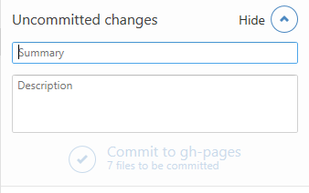
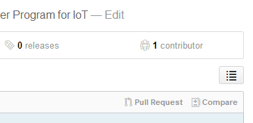

# Contribute
Thank you for your interest in contributing to Windows Developer Program for IoT for Intel Galileo.

If you want to contribute to the development kit, read on!
The first time you'd like to commit a change to a repository, perform the following:

We're actively accepting work for the following areas:

* [Getting Started Guide](https://github.com/ms-iot/content)
* [Galileo SDK](https://github.com/ms-iot/galileo-sdk)
* Tutorials
* Adding or removing pointers to Projects
* Adding or removing pointers to Library Ports
* Adding or removing pointers to Arduino Shield Ports

## Fork the repository
1. Familiarize yourself with git by reading through the [GitHub documentation](https://help.github.com/ "GitHub help")
1. Familiarize yourself with the GitHub app for Windows via the [GitHub app documentation](https://help.github.com/categories/58/articles)
1. Create a GitHub account by starting at [GitHub home](https://github.com/)
1. Go to [GitHub home](https://github.com/) and navigate to the repository you'd like to contribute to, click *Fork*  
  
1. On GitHub, Navigate to your account's fork of the repository
1. On the right hand side of the repository, you'll see 'Clone in Desktop'  
     

___

##Making changes
If you are editing a fork of ms-iot/content, please submit pull request off of gh_pages.
If you are editing a fork of ms-iot/galileo-sdk, please submit pull request off of develop.

1. Make your edits, build and test. Use the repository's readme for any specific editing requirements, build instructions, and testing methods.
1. Add your edits via the GitHub app  
   

1. Push your changes to your fork  
   

###Submitting a Pull Request
1. Goto [GitHub](GitHub.com) and navigate to your fork
1. Click the *Pull Request* at the top of the page  
  
1. Give your pull request a title and describe the change to be made. Include a task or issue number if appropriate.
1. Submit your pull request

___

#Iterating on the Galileo SDK
Fork  ms-iot/galileo-sdk as described above in the contribute section.

##Configure Visual Studio
You’ll want to redirect visual studio’s *user templates* to the repository you are working in.
*Tools -> Options*

Under *Projects and Solutions*, select *General*

###For Visual Studio Pro and Ultimate

*Tools -> Library Package Manager -> Package Manager Settings*

###For Visual Studio Express
*Tools -> Nuget Package Manager -> Package Manager Settings*

##Build the Nuget package
Please download the Nuget command line utility [nuget.exe](http://nuget.org/nuget.exe) into the Galileo-SDK root folder.


build-nupkg.cmd


##Building the Project
You can now goto *File -> New Project* then Select *Templates -> Visual C++ -> Galileo -> Galileo Wiring app*:

###Build the app
You can now build the application. Please refer to the [Hello Blinky Sample](HelloBlinky.htm) for details on how to build and deploy an application.

###Iterate in the Nuget
Now you need to make changes to the Nuget, you’ll need to uninstall it first. Right click on the Project in the solution and select *Manage Nuget Packages*.

Now Uninstall the Galileo SDK by clicking the uninstall button:

Then select *Online* and *Local Source*

###Install it!
Your updates will be there.

### Notes!
* While you can change your local headers, they will get nuked when reinstalling the nuget package.
* Don’t check in your packages...
* Don’t check in binaries

___

#Best Practices

##Do not check in binaries
Once a binary is added to the repository, it will be there forever.

Please do not add binaries to Git including:
* The output from a build (debug/release)
* SDF file (code database)
* Nuget package directories

Acceptable binaries:
* PNG, JPG, or other image formats

