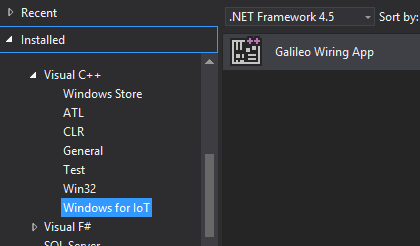

# How to Contribute
Thank you for your interest in contributing to Windows Developer Program for IoT for Intel Galileo.

We're actively accepting work for the following areas:

* <a href="https://github.com/ms-iot/content" target="_blank">Getting Started Guide</a>
* <a href="https://github.com/ms-iot/galileo-sdk" target="_blank">Galileo SDK</a>
* Tutorials
* Adding or removing pointers to Projects
* Adding or removing pointers to Library Ports
* Adding or removing pointers to Arduino Shield Ports

___

## References
1. <a href="https://help.github.com/" title="GitHub documentation" target="_blank">GitHub Documentation</a>
1. <a href="https://github.com/github/training-materials/blob/master/downloads/github-git-cheat-sheet.pdf?raw=true" title="Git Cheatsheet!">Git Cheatsheet!</a>
1. <a href="http://www.git-scm.com/book/en/" title="Git Documentation">Git Documentation</a>

___

## <a href="/ContributionGuidelines.htm">Guidelines</a>
___

## Fork the repository
1. Create a GitHub account by starting at <a href="https://github.com/" target="_blank">GitHub Home</a>
1. Go to <a href="https://github.com/" target="_blank">GitHub Home</a> and navigate to the repository you'd like to contribute to, click *Fork*  
  
1. On GitHub, Navigate to your account's fork of the repository
1. Clone the repository in one of two ways:
    1. You can use command line  
    <kbd>git clone [link to .git] [NameYourLocalFolder]</kbd>
    1. Or launch the GitHub app by clicking 'Clone in Desktop' on the right hand side of the repository  
       

___

##Using Git
If you are editing a fork of ms-iot/content, please submit pull request off of develop. 
If you are editing a fork of ms-iot/galileo-sdk, please submit pull request off of develop.

For clarification, what we mean when we say: 
**local repository:** the cloned repository that you have one on your machine 
**forked repository:** the fork you made from the main repository. This sits up on github's servers. (Also known as <b>"origin"</b>) 
**main repository:** the original repository that you forked from. This is the common ms-iot repository hosted on github's servers. (Also known as <b>"upstream"</b>) 

####Setting up
1. Set up your upstream 
    * <kbd>git remote add upstream [link to .git]</kbd>

####Making changes
1. Make your edits, build, and test. Use the repository's readme for any specific editing requirements, build instructions, and testing methods.
    * <kbd>git add [file]</kbd>
1. Commit your changes to your local repository.
    * <kbd>git commit -m "[descriptive message]" </kbd>
    
####Submitting a Pull Request
1. Fetch upstream
    * <kbd>git fetch --all</kbd>
1. Rebase upstream (This should now put your changes on top of the main repository's history.)
    * <kbd>git rebase -i upstream/develop</kbd>
    * This may highlight conflicts that you will have to hand-merge
        * You can use your favorite merging tool or even notepad for this.
    * After hand-merging, you can continue the rebase
        * <kbd>git add [fileYouHandMerged]</kbd>
        * <kbd>git rebase --continue</kbd>
1. Force-push your changes to your forked repository.
    * <kbd>git push -f origin develop</kbd>
1. Now submit your pull request from your forked repository using the GitHub website.

####Making changes to a Pull Request
1. Make your new changes, fetch upstream, rebase upstream, and force-push your changes.
    * If your pull request was never closed, you should not have to submit a new pull request. It should automatically update.
    
___

#Iterating on the Galileo SDK
Fork  ms-iot/galileo-sdk as described above in the contribute section.

##Configure Visual Studio
You’ll want to redirect visual studio’s *user templates* to the repository you are working in.
*Tools -> Options*

Under *Projects and Solutions*, select *General*

###For Visual Studio Pro and Ultimate

*Tools -> Library Package Manager -> Package Manager Settings*

 

1. Click the "+" button to add a new source
1. Set the name to something descriptive, such as: "Local Source"
1. Click the "..." button and navigate to your local sources directory
1. Click the "Update" button to save the Package Sources changes

###For Visual Studio Express
*Tools -> Nuget Package Manager -> Package Manager Settings*

 

1. Click the "+" button to add a new source
1. Set the name to something descriptive, such as: "Local Source"
1. Click the "..." button and navigate to your local sources directory
1. Click the "Update" button to save the Package Sources changes

##Build the Nuget package
Please download the Nuget command line utility [nuget.exe](http://nuget.org/nuget.exe) into the Galileo-SDK source folder.


build-nupkg.cmd


##Building the Project
You can now goto *File -> New Project* then Select *Templates -> Visual C++ -> Galileo -> Galileo Wiring app*:

###Build the app
You can now build the application. Please refer to the [Hello Blinky Sample](HelloBlinky.htm) for details on how to build and deploy an application.

###Iterate in the Nuget Package
Now you need to make changes to the Nuget Package, you’ll need to uninstall it first. Right click on the Project in the solution and select *Manage Nuget Packages*.

Now Uninstall the Galileo SDK by clicking the uninstall button:

Then select *Online* and *Local Source*

###Install it!
Your updates will be there.

### Notes!
* While you can change your local headers, they will get nuked when reinstalling the nuget package.
* Don’t check in your packages...
* Don’t check in binaries

___

#Best Practices

##Do not check in binaries
Once a binary is added to the repository, it will be there forever.

Please do not add binaries to Git including:
* The output from a build (debug/release)
* SDF file (code database)
* Nuget package directories

Acceptable binaries:
* PNG, JPG, or other image formats